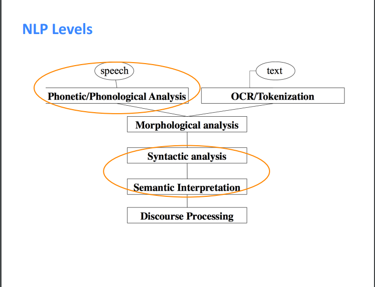

# Nature Language Processing with Deep Learning

## NLP Levels
1. 本课程将主要从 **Syntactic analysis**, **Semantic Interpretation**两方面介绍， 并涉及 **Phonetic/Phonological Analysis**
   

## Why is NLP hard?
1. 表示复杂
2. 语言精炼
3. 语言表达的解释依赖于现实世界、公共感知、上下文表示
